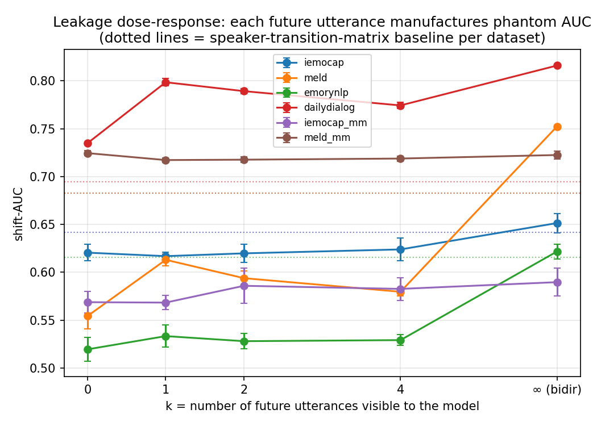

# Leakage dose-response

Shift-AUC as a function of k, the number of future utterances visible to the model. k=0 and k=infinity are read from existing results; k in {1, 2, 4} use LookaheadGRU, a causal GRU with a mean-pooled peek at the next k utterances.

| dataset | transition | k=0 | k=1 | k=2 | k=4 | k=infinity (bidirectional) |
|---|---|---|---|---|---|---|
| iemocap | 0.642 | 0.621±0.009 | 0.617±0.004 | 0.620±0.009 | 0.624±0.012 | 0.651±0.010 |
| meld | 0.683 | 0.554±0.013 | 0.613±0.006 | 0.594±0.008 | 0.580±0.004 | 0.752±0.001 |
| emorynlp | 0.616 | 0.520±0.013 | 0.533±0.012 | 0.528±0.008 | 0.529±0.006 | 0.622±0.008 |
| dailydialog | 0.695 | 0.735±0.001 | 0.799±0.004 | 0.789±0.003 | 0.774±0.003 | 0.816±0.001 |
| iemocap_mm | 0.642 | 0.569±0.011 | 0.568±0.007 | 0.586±0.018 | 0.583±0.012 | 0.590±0.015 |
| meld_mm | 0.683 | 0.725±0.003 | 0.717±0.002 | 0.718±0.003 | 0.719±0.003 | 0.723±0.004 |
